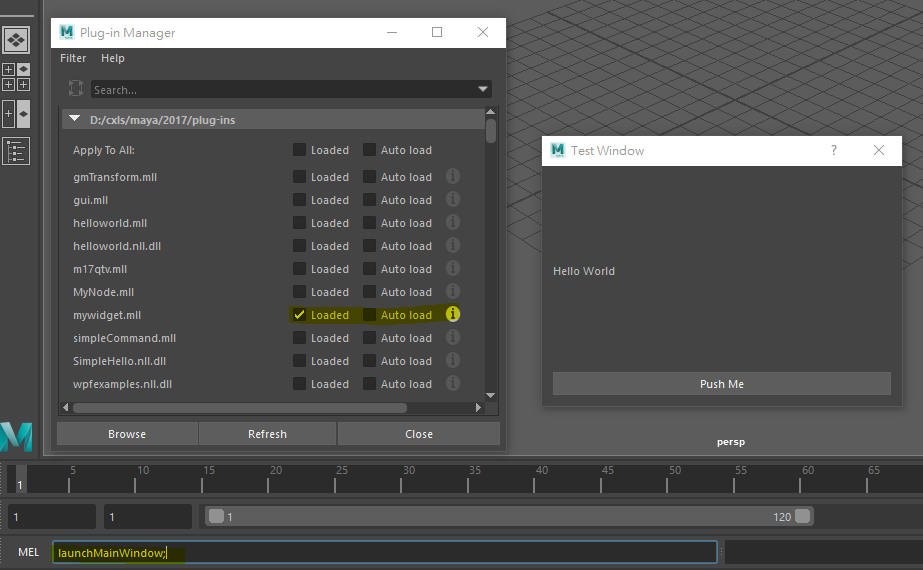

# How to write a Qt Gui in Maya API use Visual Studio

## Step 0. Prepare libraries & tools

### Step 0-1. Build Qt 5 library for Maya 2017

+ [The details please see this document](./build_qt5.6.1_Maya2017.md)

### Step 0-2. Install Visual Studio Qt Add-in

+ [Visual Studio add-in](https://download.qt.io/official_releases/vsaddin/)

### Step 0-3. Setup Maya API environment & links

+ [The details please see this document](../vscpp_settings.md)

## Step 1. Header file (mainwindow.h)

### Step 1-0. Include

```cpp
#ifndef _MAIN_WINDOW_H // avoid duplicated include
#define _MAIN_WINDOW_H
// Qt header
// This example is derived from QDialog
#include <QDialog>
// QWidget is base GUI class in QT
#include <QWidget>
// We need QPointer to store QT window in Maya command.
#include <QPointer>
#include <QPushButton>
// Maya header
#include <maya/MPxCommand.h>
#include <maya/MArgList.h>
```

### Step 1-1. We need a class derived from QDialog

```cpp
class MainWindow : public QDialog
{
    // Must put "Q_OBJECT" marco at first.
    Q_OBJECT
public:
    // Main constructor, first default argument is QWidget * get parent.
    // By default, we need parent to "Maya Main Window"(by a function).
    MainWindow(QWidget * parent = 0);
    // Main virtual destructor, do nothing.
    virtual ~MainWindow();
private slots:
    // Create a private slots, here is optional.
    void execute();
private:
    // Create a QT button. here is optional.
    QPushButton * ptr_button;
};
```

### Step 1-2. We need a Maya Command to call custom window

```cpp
class MainWindowCmd : public MPxCommand
{
public:
    // Maya command constructor, do nothing.
    MainWindowCmd();
    // Maya command destructor, do nothing.
    virtual ~MainWindowCmd();
    // Maya command doIt virtual member function.
    virtual MStatus doIt(const MArgList &);
    // The Maya command name (static).
    static const char * kCmdName;
    // This QPointer will store the main window address (static).
    static QPointer<MainWindow> qptr_mainwindow;
    // Maya command creator (static)
    static void * creator();
    // Clean up the main window when unload plug-in.
    static void cleanup();
};
```

### Step 1-3. Finally

```cpp
#endif
```

## Step 2. Implement (mainwindow.cpp)

### Step 2-0. Include

```cpp
#include "mainwondow.h"
// In Windows, We need include Windows.h to avoid something error.
#include <Windows.h>
// Below is Qt libraries.
#include <QVBoxLayout>
#include <QLabel>
#include <QPushButton>
#include <QPointer>
#include <QDebug>
// Below are Maya API include.
#include <maya/MQtUtil.h>
#include <maya/MGlobal.h>
#include <maya/MDagPath.h>
#include <maya/MSelectionList.h>
```

### Step 2-1. Define static member

```cpp
// Define the command name (call in Maya), do not add static modifier.
const char * MainWindowCmd::kCmdName = "launchMainWindow";
```

### Step 2-2. Write a helper function to get Maya main window

```cpp
QWidget * _GetMayaMainWindow()
{
    // Use MQtUtil::mainWindow
    QWidget * ptr_mainwindow = MQtUtil::mainWindow();
    return ptr_mainwindow;
}
```

### Step 2-3. Implement Qt window

```cpp
MainWindow::MainWindow(QWidget * parent):
    QDialog(parent),
    ptr_button(new QPushButton("Push"))
{
    this->setObjectName("customWindow");
    this->setWindowTitle("Test Window");
    this->setFixedSize(QSize(360, 240));
    QVBoxLayout * ptr_layout = new QVBoxLayout;
    ptr_layout->addWidget(new QLabel("Hello World"));
    ptr_layout->addWidget(ptr_button);
    this->setLayout(ptr_layout);
    // Do Qt connections
    connect(
        ptr_button,
        &QPushButton::clicked,
        this,
        &MainWindow::execute
    );
}
// Destructor, do nothing.
MainWindow::~MainWindow()
{
}
// Simple execute member function
void MainWindow::execute()
{
    // Just try to display message.
    MGlobal::displayInfo("Hello World!");
}
```

### Step 2-4. Implement Maya command

```cpp
// Initialize QPointer in MayaWindowCmd
QPointer<MainWindow> MainWindowCmd::qptr_mainwindow;
// Constructor & Destructor do nothing.
MainWindowCmd::MainWindowCmd()
{
}
//
MainWindowCmd::~MainWindowCmd()
{
}
// The creator for Maya API
void * MainwindowCmd::creator()
{
    return new MainWindowCmd();
}
// The additional function to clean up MainWindow.
void MainWindowCmd::cleanUp()
{
    if ( !qptr_mainwindow.isNull() )
    {
        delete qptr_mainwindow;
    }
}
// Do it member function.
MStatus MainWindowCmd::doIt(const MArgList & argList)
{
    // When qptr_mainwindow is not handle any QWidget address,
    // We need to create a new class that is we made it before.
    // The constructor's first argument must to call _GetMayaMainWindow().
    // This custom window will be Maya's child.
    // If the class instance is exists, Just to raise it.
    if ( qptr_mainwindow.isNull() )
    {
        qptr_mainwindow = new MainWindow(_GetMayaMainWindow());
        qptr_mainwindow->show();
    }
    else
    {
        qptr_mainwindow->raise()
    }
    return MS::kSuccess;
}
```

## Step 3. Maya API plug-in register

### Step 3-0. Including

```cpp
#include "mainwindow.h"
#include <maya/MFnPlugin.h>
#include <maya/MGlobal.h>
```

### Step 3-1. Initialize plug-in

```cpp
MStatus initializePlugin(MObject obj)
{
    MStatus stat;
    MFnPlugin fnPlugin(obj, "Author", "1.0", "Any", &stat);
    stat = fnPlugin.registerCommand(
        MainWindowCmd::kCmdName,
        MainWindowCmd::creator
    );
    if ( stat != MS::kSuccess )
    {
        MGlobal::displayError("Failed to register command!");
    }
    return stat;
}
```

### Step 3-2. Uninitialize plug-in

```cpp
MStatus uninitializePlugin(MObject obj)
{
    MStatus stat;
    MFnPlugin fnPlugin(obj);
    stat = fnPlugin.deregisterCommand(MainWindowCmd::kCmdName);
    if ( stat != MS::kSuccess )
    {
        MGlobal::displayError("Failed to deregister command!");
    }
    // clean up the QT Window
    MainWindowCmd::cleanup();
    return stat;
}
```

### Step 4. Compile, Loading in Maya, Launch



---

## Additional

+ I use Visual Studio 2012 community with QT5 (QT 5.6.1).
+ This example just for 2017 or upper(Maya 2017 supported QT 5).
+ This example is just in Windows OS.